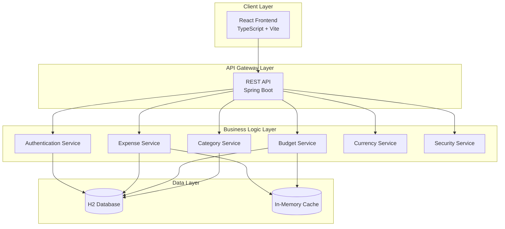
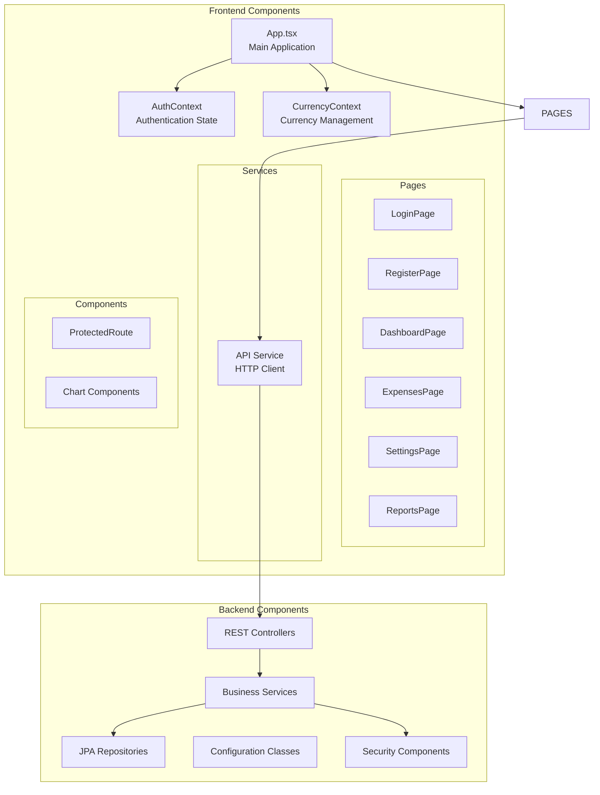
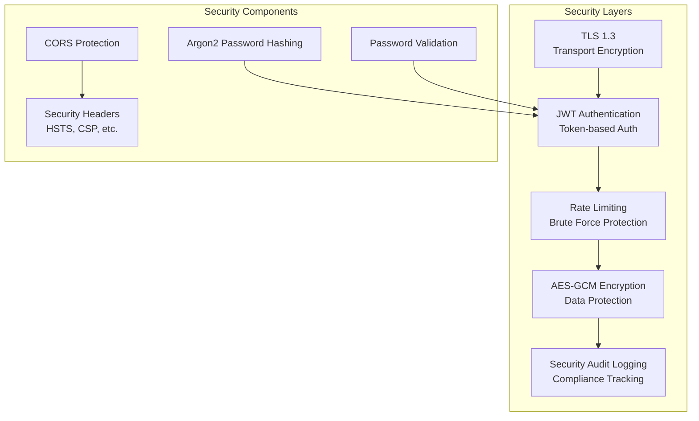
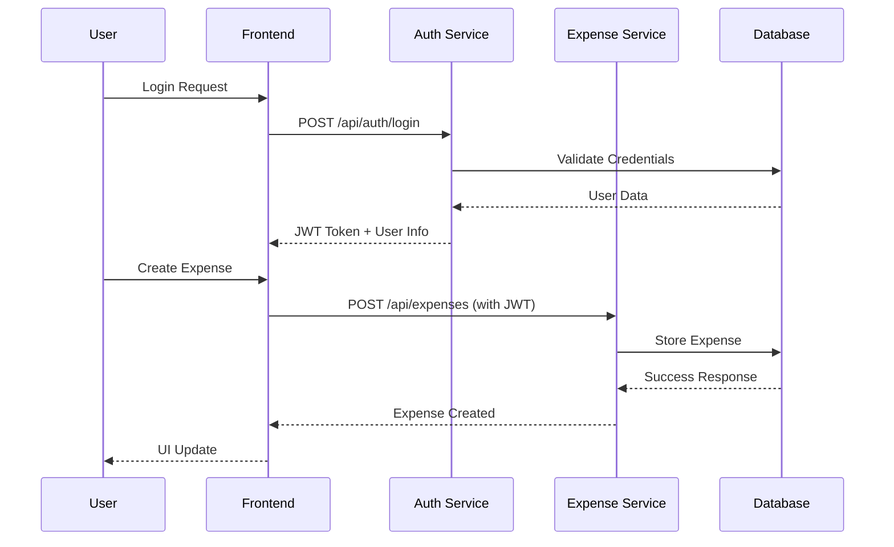
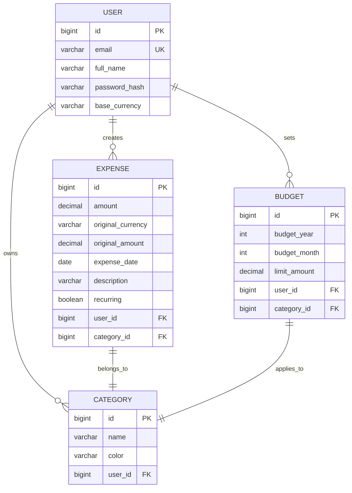

# Expense Manager - Functional Specification Document

## Table of Contents

1. [Executive Summary](#1-executive-summary)
2. [System Architecture](#2-system-architecture)
3. [Functional Requirements](#3-functional-requirements)
4. [Security Requirements](#4-security-requirements)
5. [Technical Specifications](#5-technical-specifications)
6. [Database Schema](#6-database-schema)
7. [API Specifications](#7-api-specifications)
8. [User Interface Design](#8-user-interface-design)
9. [Testing Strategy](#9-testing-strategy)
10. [Deployment Guide](#10-deployment-guide)

## 1. Executive Summary

### 1.1 Purpose
The Expense Manager is a secure, full-stack web application designed to help users track, manage, and analyze their personal expenses. The system provides comprehensive expense tracking with budget management, categorization, and detailed reporting capabilities.

### 1.2 Scope
- User registration and authentication
- Expense creation, editing, and deletion
- Category management
- Budget setting and monitoring
- Financial reporting and analytics
- Multi-currency support
- Secure data transmission and storage

### 1.3 Key Features
- Secure user authentication with JWT tokens
- Real-time expense tracking
- Budget monitoring with alerts
- Interactive charts and reports
- Multi-currency support
- Responsive web interface
- Enterprise-grade security

## 2. System Architecture

### 2.1 High-Level Architecture



### 2.2 Component Architecture



### 2.3 Security Architecture



### 2.4 Data Flow Architecture



## 3. Functional Requirements

### 3.1 User Management

#### FR-USER-001: User Registration
- Users can register with email, full name, and password
- Password must meet security requirements (8+ chars, mixed case, digits, special chars)
- Email validation and uniqueness checking
- Default categories created automatically

#### FR-USER-002: User Authentication
- JWT-based authentication
- Secure login with rate limiting
- Account lockout after failed attempts
- Session management with secure cookies

#### FR-USER-003: Profile Management
- View and update user profile
- Change base currency (set during first budget creation)
- Account deactivation (future enhancement)

### 3.2 Expense Management

#### FR-EXP-001: Expense Creation
- Add expenses with amount, currency, date, category, description
- Support for recurring expenses
- Real-time currency conversion
- Automatic base currency conversion

#### FR-EXP-002: Expense Retrieval
- List expenses with filtering (date range, category)
- Pagination support
- Sorting by date, amount, category
- Export functionality (future enhancement)

#### FR-EXP-003: Expense Modification
- Edit existing expenses
- Update all expense fields
- Recalculation of converted amounts
- Audit trail of changes

#### FR-EXP-004: Expense Deletion
- Soft delete with confirmation
- Cascade updates to reports and budgets
- Recovery mechanism (future enhancement)

### 3.3 Category Management

#### FR-CAT-001: Category Creation
- Create custom categories with names and colors
- Color-coded visual organization
- Validation for unique category names
- Default categories provided

#### FR-CAT-002: Category Organization
- Hierarchical category structure (future enhancement)
- Category reordering and grouping
- Bulk category operations

### 3.4 Budget Management

#### FR-BUD-001: Budget Setting
- Set monthly budgets per category
- Overall budget limits
- Budget templates (future enhancement)
- Currency-aware budget amounts

#### FR-BUD-002: Budget Monitoring
- Real-time budget utilization tracking
- Visual progress indicators
- Budget alerts and notifications
- Budget vs. actual spending reports

#### FR-BUD-003: Budget Analytics
- Budget performance over time
- Forecasting and trend analysis
- Budget adjustment recommendations

### 3.5 Currency Support

#### FR-CUR-001: Multi-Currency Support
- Support for 12 major currencies
- Real-time exchange rate updates
- Automatic currency conversion
- User-selectable base currency

#### FR-CUR-002: Currency Display
- Consistent currency formatting
- Currency symbol display
- Localized number formatting

### 3.6 Reporting and Analytics

#### FR-REP-001: Financial Reports
- Monthly spending summaries
- Category-wise breakdowns
- Trend analysis with interactive charts
- Budget performance reports

#### FR-REP-002: Data Visualization
- Interactive bar charts and graphs
- Pie charts for category distribution
- Time-series analysis
- Export capabilities (PDF, CSV)

## 4. Security Requirements

### 4.1 Authentication Security

#### SR-AUTH-001: Password Security
- Argon2 password hashing algorithm
- Minimum password complexity requirements
- Prevention of common password usage
- Secure password reset mechanism

#### SR-AUTH-002: Session Security
- JWT tokens with expiration
- Secure token storage (HttpOnly cookies)
- Automatic session timeout
- Concurrent session management

#### SR-AUTH-003: Brute Force Protection
- Rate limiting (5 attempts per IP/email)
- Account lockout (15-minute duration)
- Progressive delay mechanisms
- IP-based tracking

### 4.2 Data Security

#### SR-DATA-001: Transport Security
- TLS 1.3 encryption for all communications
- Certificate-based authentication
- Perfect forward secrecy
- Secure cookie attributes

#### SR-DATA-002: Data Encryption
- AES-GCM encryption for sensitive data
- Encrypted database storage (future)
- Secure key management
- Data integrity verification

#### SR-DATA-003: Input Validation
- Server-side input sanitization
- SQL injection prevention
- XSS protection
- CSRF protection

### 4.3 Audit and Compliance

#### SR-AUD-001: Security Logging
- Comprehensive audit trails
- Hashed sensitive data logging
- Security event monitoring
- Log integrity protection

#### SR-AUD-002: Compliance Requirements
- GDPR compliance for data handling
- Secure data retention policies
- User consent management
- Data export/deletion capabilities

## 5. Technical Specifications

### 5.1 Technology Stack

#### Backend
- **Framework**: Spring Boot 3.3.0
- **Language**: Java 17
- **Security**: Spring Security 6.3.0
- **Database**: H2 (development), PostgreSQL (production)
- **ORM**: Spring Data JPA/Hibernate
- **Authentication**: JWT (JSON Web Tokens)
- **Password Hashing**: Argon2
- **Build Tool**: Maven

#### Frontend
- **Framework**: React 18
- **Language**: TypeScript
- **Build Tool**: Vite
- **Styling**: Tailwind CSS
- **Charts**: Recharts
- **HTTP Client**: Axios
- **State Management**: React Context

#### Security
- **TLS**: OpenSSL certificates
- **Encryption**: AES-GCM 256-bit
- **Hashing**: Argon2id
- **Headers**: Security headers (HSTS, CSP, etc.)

### 5.2 Performance Requirements

#### PR-PERF-001: Response Times
- API response time: <200ms for simple operations
- Page load time: <2 seconds
- Database query time: <100ms
- Report generation: <5 seconds

#### PR-PERF-002: Scalability
- Support for 10,000+ concurrent users
- Horizontal scaling capability
- Database connection pooling
- CDN integration for static assets

#### PR-PERF-003: Availability
- 99.9% uptime requirement
- Graceful error handling
- Automatic failover mechanisms
- Monitoring and alerting

### 5.3 Browser Compatibility

- **Chrome**: 90+
- **Firefox**: 88+
- **Safari**: 14+
- **Edge**: 90+
- **Mobile browsers**: iOS Safari, Chrome Mobile

## 6. Database Schema

### 6.1 Entity Relationship Diagram



### 6.2 Table Specifications

#### Users Table
```sql
CREATE TABLE users (
    id BIGINT PRIMARY KEY AUTO_INCREMENT,
    email VARCHAR(255) UNIQUE NOT NULL,
    full_name VARCHAR(255) NOT NULL,
    password_hash VARCHAR(255) NOT NULL,
    base_currency VARCHAR(3)
);
```

#### Expenses Table
```sql
CREATE TABLE expenses (
    id BIGINT PRIMARY KEY AUTO_INCREMENT,
    amount DECIMAL(38,2) NOT NULL,
    original_currency VARCHAR(3),
    original_amount DECIMAL(38,2),
    expense_date DATE NOT NULL,
    description VARCHAR(255),
    recurring BOOLEAN DEFAULT FALSE,
    user_id BIGINT NOT NULL,
    category_id BIGINT,
    FOREIGN KEY (user_id) REFERENCES users(id),
    FOREIGN KEY (category_id) REFERENCES categories(id)
);
```

#### Categories Table
```sql
CREATE TABLE categories (
    id BIGINT PRIMARY KEY AUTO_INCREMENT,
    name VARCHAR(255) NOT NULL,
    color VARCHAR(7),
    user_id BIGINT NOT NULL,
    FOREIGN KEY (user_id) REFERENCES users(id)
);
```

#### Budgets Table
```sql
CREATE TABLE budgets (
    id BIGINT PRIMARY KEY AUTO_INCREMENT,
    budget_year INT NOT NULL,
    budget_month INT NOT NULL,
    limit_amount DECIMAL(38,2) NOT NULL,
    user_id BIGINT NOT NULL,
    category_id BIGINT,
    FOREIGN KEY (user_id) REFERENCES users(id),
    FOREIGN KEY (category_id) REFERENCES categories(id)
);
```

## 7. API Specifications

### 7.1 Authentication Endpoints

#### POST /api/auth/register
**Request Body:**
```json
{
  "email": "user@example.com",
  "password": "SecurePass123!",
  "fullName": "John Doe"
}
```

**Response:**
```json
{
  "token": "jwt.token.here",
  "email": "user@example.com",
  "fullName": "John Doe",
  "baseCurrency": "INR"
}
```

#### POST /api/auth/login
**Request Body:**
```json
{
  "email": "user@example.com",
  "password": "SecurePass123!"
}
```

**Response:** Same as registration

### 7.2 Expense Endpoints

#### GET /api/expenses
**Query Parameters:**
- `startDate`: ISO date string
- `endDate`: ISO date string
- `categoryId`: number

**Response:**
```json
[
  {
    "id": 1,
    "amount": 1500.00,
    "originalCurrency": "USD",
    "originalAmount": 20.00,
    "date": "2024-01-15",
    "description": "Lunch",
    "recurring": false,
    "category": {
      "id": 1,
      "name": "Food & Dining",
      "color": "#ef4444"
    }
  }
]
```

#### POST /api/expenses
**Request Body:**
```json
{
  "amount": 1500.00,
  "currency": "USD",
  "date": "2024-01-15",
  "description": "Lunch",
  "recurring": false,
  "categoryId": 1
}
```

### 7.3 Category Endpoints

#### GET /api/categories
**Response:**
```json
[
  {
    "id": 1,
    "name": "Food & Dining",
    "color": "#ef4444"
  }
]
```

#### POST /api/categories
**Request Body:**
```json
{
  "name": "Transportation",
  "color": "#f59e0b"
}
```

### 7.4 Budget Endpoints

#### GET /api/budgets
**Query Parameters:**
- `year`: number
- `month`: number

**Response:**
```json
[
  {
    "id": 1,
    "year": 2024,
    "month": 1,
    "categoryId": 1,
    "categoryName": "Food & Dining",
    "limitAmount": 15000.00,
    "spent": 8500.00,
    "remaining": 6500.00,
    "percentUsed": 56.67
  }
]
```

## 8. User Interface Design

### 8.1 Application Layout

```
┌─────────────────────────────────────────────────────────┐
│                    Header Navigation                     │
│ ┌─────────┐ ┌─────────┐ ┌─────────┐ ┌─────────┐ ┌─────┐ │
│ │         │ │         │ │         │ │         │ │     │ │
│ │  Logo   │ │Dashboard│ │Expenses │ │Settings│ │User │ │
│ │         │ │         │ │         │ │         │ │Menu │ │
│ └─────────┘ └─────────┘ └─────────┘ └─────────┘ └─────┘ │
└─────────────────────────────────────────────────────────┘
┌─────────────────────────────────────────────────────────┐
│                                                         │
│                    Main Content Area                    │
│                                                         │
│ ┌─────────────────────────────────────────────────────┐ │
│ │                    Page Content                     │ │
│ └─────────────────────────────────────────────────────┘ │
└─────────────────────────────────────────────────────────┘
```

### 8.2 Dashboard Layout

```
┌─────────────────────────────────────────────────────────┐
│                     Dashboard                          │
├─────────────────────────────────────────────────────────┤
│ ┌─────────────────┐ ┌─────────────────┐ ┌─────────────┐ │
│ │   Total Spent   │ │  Budget Status  │ │   Monthly   │ │
│ │    ₹45,230      │ │     78%         │ │   Trends    │ │
│ │   +12% vs last  │ │   ████████░░    │ │   Chart     │ │
│ │     month       │ │                 │ │             │ │
│ └─────────────────┘ └─────────────────┘ └─────────────┘ │
│                                                         │
│ ┌─────────────────────────────────────────────────────┐ │
│ │              Category Breakdown Pie Chart          │ │
│ └─────────────────────────────────────────────────────┘ │
└─────────────────────────────────────────────────────────┘
```

### 8.3 Expenses Page Layout

```
┌─────────────────────────────────────────────────────────┐
│                      Expenses                          │
├─────────────────────────────────────────────────────────┤
│ ┌─────────────────┐ ┌─────────────────┐ ┌─────────────┐ │
│ │   Add Expense   │ │   Filter By     │ │   Export    │ │
│ │   [+] Button    │ │   Date/Category │ │   Button    │ │
│ └─────────────────┘ └─────────────────┘ └─────────────┘ │
│                                                         │
│ ┌─────────────────────────────────────────────────────┐ │
│ │                 Expenses Table                      │ │
│ │ ┌─────────────────────────────────────────────────┐ │ │
│ │ │ Date │ Description │ Category │ Amount │ Action │ │ │
│ │ ├─────────────────────────────────────────────────┤ │ │
│ │ │ 15/1 │ Lunch       │ Food     │ ₹500   │ Edit   │ │ │
│ │ │ 16/1 │ Bus Ticket  │ Trans    │ ₹200   │ Delete │ │ │
│ │ └─────────────────────────────────────────────────┘ │ │
│ └─────────────────────────────────────────────────────┘ │
└─────────────────────────────────────────────────────────┘
```

### 8.4 Settings Page Layout

```
┌─────────────────────────────────────────────────────────┐
│                      Settings                          │
├─────────────────────────────────────────────────────────┤
│ ┌─────────────────────────────────┐ ┌─────────────────┐ │
│ │        Categories              │ │    Budgets      │ │
│ │ ┌─────────────────────────────┐ │ │ ┌─────────────┐ │ │
│ │ │ [+] Add Category            │ │ │ │ Jan 2024 ▲▼ │ │ │
│ │ │ Food & Dining    [🗑️]       │ │ │ │ Food: ₹15k  │ │ │
│ │ │ Transportation   [🗑️]       │ │ │ │ Trans: ₹5k  │ │ │
│ │ │ Shopping         [🗑️]       │ │ │ │ [+] Add     │ │ │
│ │ └─────────────────────────────┘ │ │ └─────────────┘ │ │
│ └─────────────────────────────────┘ └─────────────────┘ │
│                                                         │
│ ┌─────────────────────────────────────────────────────┐ │
│ │              Base Currency Setup                    │ │
│ │ ┌─────────────────────────────────────────────────┐ │ │
│ │ │ Select Base Currency: [INR ▼]                  │ │ │
│ │ │ All expenses will be converted to this currency │ │ │
│ │ └─────────────────────────────────────────────────┘ │ │
│ └─────────────────────────────────────────────────────┘ │
└─────────────────────────────────────────────────────────┘
```

## 9. Testing Strategy

### 9.1 Unit Testing

#### Backend Unit Tests
```java
@SpringBootTest
class ExpenseServiceTest {

    @Autowired
    private ExpenseService expenseService;

    @Test
    void shouldCreateExpenseSuccessfully() {
        // Test expense creation
        ExpenseRequest request = new ExpenseRequest();
        // ... setup test data

        Expense expense = expenseService.createExpense(user, request);

        assertThat(expense.getAmount()).isEqualTo(request.getAmount());
        assertThat(expense.getUser()).isEqualTo(user);
    }

    @Test
    void shouldValidatePasswordStrength() {
        // Test password validation
        assertThrows(IllegalArgumentException.class, () -> {
            PasswordValidationUtil.validatePassword("weak");
        });
    }
}
```

#### Frontend Unit Tests
```typescript
import { render, screen } from '@testing-library/react';
import { ExpenseForm } from '../components/ExpenseForm';

describe('ExpenseForm', () => {
  it('should validate required fields', async () => {
    render(<ExpenseForm onSubmit={mockSubmit} />);

    const submitButton = screen.getByRole('button', { name: /add expense/i });
    fireEvent.click(submitButton);

    expect(await screen.findByText('Amount is required')).toBeInTheDocument();
  });
});
```

### 9.2 Integration Testing

#### API Integration Tests
```java
@SpringBootTest(webEnvironment = SpringBootTest.WebEnvironment.RANDOM_PORT)
class ExpenseControllerIntegrationTest {

    @Autowired
    private TestRestTemplate restTemplate;

    @Test
    void shouldCreateAndRetrieveExpense() {
        // Create expense
        ExpenseRequest request = new ExpenseRequest();
        // ... setup

        ResponseEntity<Expense> createResponse = restTemplate
            .withBasicAuth("user", "password")
            .postForEntity("/api/expenses", request, Expense.class);

        assertThat(createResponse.getStatusCode()).isEqualTo(HttpStatus.OK);

        // Retrieve expense
        ResponseEntity<Expense[]> getResponse = restTemplate
            .withBasicAuth("user", "password")
            .getForEntity("/api/expenses", Expense[].class);

        assertThat(getResponse.getBody()).hasSizeGreaterThan(0);
    }
}
```

### 9.3 Security Testing

#### Penetration Testing Checklist
- [ ] SQL Injection prevention
- [ ] XSS vulnerability testing
- [ ] CSRF protection verification
- [ ] Rate limiting effectiveness
- [ ] Password policy enforcement
- [ ] JWT token security
- [ ] HTTPS certificate validation
- [ ] Security headers verification

#### Load Testing
```javascript
import { check } from 'k6';
import http from 'k6/http';

export let options = {
  stages: [
    { duration: '2m', target: 100 }, // Ramp up to 100 users
    { duration: '5m', target: 100 }, // Stay at 100 users
    { duration: '2m', target: 200 }, // Ramp up to 200 users
  ],
};

export default function () {
  let response = http.get('https://localhost:8443/api/expenses');
  check(response, { 'status is 200': (r) => r.status === 200 });
}
```

### 9.4 End-to-End Testing

#### Cypress E2E Tests
```javascript
describe('Expense Management', () => {
  it('should allow user to create expense', () => {
    cy.visit('/login');
    cy.get('[data-cy=email]').type('user@example.com');
    cy.get('[data-cy=password]').type('SecurePass123!');
    cy.get('[data-cy=login-button]').click();

    cy.url().should('include', '/dashboard');

    cy.visit('/expenses');
    cy.get('[data-cy=add-expense]').click();
    cy.get('[data-cy=amount]').type('100');
    cy.get('[data-cy=description]').type('Test expense');
    cy.get('[data-cy=submit]').click();

    cy.get('[data-cy=expense-list]').should('contain', 'Test expense');
  });
});
```

## 10. Deployment Guide

### 10.1 Production Environment Setup

#### Infrastructure Requirements
```
┌─────────────────────────────────────────────────────────┐
│                    Load Balancer                        │
│                    (nginx/haproxy)                      │
└─────────────────────┬───────────────────────────────────┘
                      │
           ┌──────────┴──────────┐
           │                     │
┌──────────▼─────────┐ ┌─────────▼──────────┐
│   Application      │ │   Database         │
│   Server 1         │ │   Server           │
│   (Spring Boot)    │ │   (PostgreSQL)     │
└────────────────────┘ └────────────────────┘
           │
           └──────────┬──────────┐
                      │
           ┌──────────▼─────────┐
           │   Monitoring       │
           │   (Prometheus +    │
           │    Grafana)        │
           └────────────────────┘
```

#### Docker Compose Configuration
```yaml
version: '3.8'
services:
  expense-manager-backend:
    image: expense-manager-backend:latest
    ports:
      - "8443:8443"
    environment:
      - SPRING_PROFILES_ACTIVE=prod
      - DB_URL=jdbc:postgresql://db:5432/expensedb
    depends_on:
      - db
    volumes:
      - ./ssl:/app/ssl:ro

  expense-manager-frontend:
    image: expense-manager-frontend:latest
    ports:
      - "443:443"
    depends_on:
      - backend

  db:
    image: postgres:15
    environment:
      - POSTGRES_DB=expensedb
      - POSTGRES_USER=expense_user
      - POSTGRES_PASSWORD=secure_password
    volumes:
      - postgres_data:/var/lib/postgresql/data

  nginx:
    image: nginx:alpine
    ports:
      - "80:80"
      - "443:443"
    volumes:
      - ./nginx.conf:/etc/nginx/nginx.conf:ro
      - ./ssl:/etc/ssl/certs:ro

volumes:
  postgres_data:

networks:
  expense_network:
    driver: bridge
```

### 10.2 SSL Certificate Setup

#### Let's Encrypt Certificate Generation
```bash
# Install certbot
sudo apt-get install certbot

# Generate certificate
sudo certbot certonly --standalone -d yourdomain.com

# Certificate files location
# /etc/letsencrypt/live/yourdomain.com/
# ├── cert.pem
# ├── chain.pem
# ├── fullchain.pem
# └── privkey.pem
```

#### Spring Boot SSL Configuration
```yaml
server:
  ssl:
    enabled: true
    key-store: classpath:keystore.p12
    key-store-password: ${SSL_KEYSTORE_PASSWORD}
    key-store-type: PKCS12
    key-alias: expense-manager
  port: 8443
```

### 10.3 Environment Variables

#### Production Environment Variables
```bash
# Database Configuration
DB_URL=jdbc:postgresql://localhost:5432/expensedb
DB_USERNAME=expense_user
DB_PASSWORD=secure_production_password

# JWT Configuration
JWT_SECRET=your-256-bit-secret-key-here-minimum-32-characters
JWT_EXPIRATION=86400000

# SSL Configuration
SSL_KEYSTORE_PASSWORD=secure_keystore_password
SSL_KEY_ALIAS=expense-manager

# Email Configuration (for notifications)
SMTP_HOST=smtp.gmail.com
SMTP_PORT=587
SMTP_USERNAME=your-email@gmail.com
SMTP_PASSWORD=app-specific-password

# Monitoring
PROMETHEUS_ENDPOINT=http://localhost:9090
GRAFANA_URL=http://localhost:3000
```

### 10.4 Monitoring Setup

#### Application Metrics
```yaml
management:
  endpoints:
    web:
      exposure:
        include: health,info,metrics,prometheus
  metrics:
    export:
      prometheus:
        enabled: true
```

#### Health Checks
```java
@Component
public class ApplicationHealthIndicator implements HealthIndicator {

    @Override
    public Health health() {
        // Database connectivity check
        // External service availability
        // Memory usage monitoring

        return Health.up()
            .withDetail("database", "available")
            .withDetail("memory", "normal")
            .build();
    }
}
```

### 10.5 Backup and Recovery

#### Database Backup Strategy
```bash
#!/bin/bash
# Daily database backup
DATE=$(date +%Y%m%d_%H%M%S)
BACKUP_DIR="/opt/backups"
CONTAINER_NAME="expense-manager-db"

docker exec $CONTAINER_NAME pg_dump -U expense_user expensedb > $BACKUP_DIR/backup_$DATE.sql

# Keep only last 30 days of backups
find $BACKUP_DIR -name "backup_*.sql" -mtime +30 -delete
```

#### Disaster Recovery Plan
1. **Database Recovery**: Automated daily backups with point-in-time recovery
2. **Application Recovery**: Blue-green deployment strategy
3. **Data Integrity**: Checksum verification for backups
4. **Failover**: Automatic failover to backup instances

### 10.6 Performance Optimization

#### Database Optimization
```sql
-- Create indexes for performance
CREATE INDEX idx_expenses_user_date ON expenses(user_id, expense_date);
CREATE INDEX idx_expenses_category ON expenses(category_id);
CREATE INDEX idx_budgets_user_month ON budgets(user_id, budget_year, budget_month);

-- Partition large tables by date
CREATE TABLE expenses_y2024 PARTITION OF expenses
    FOR VALUES FROM ('2024-01-01') TO ('2025-01-01');
```

#### Caching Strategy
```java
@Configuration
@EnableCaching
public class CacheConfig {

    @Bean
    public RedisCacheManager cacheManager(RedisConnectionFactory connectionFactory) {
        return RedisCacheManager.builder(connectionFactory)
            .cacheDefaults(RedisCacheConfiguration.defaultCacheConfig()
                .entryTtl(Duration.ofHours(1)))
            .build();
    }
}
```

### 10.7 Security Hardening

#### Production Security Checklist
- [ ] SSL/TLS certificates properly configured
- [ ] Security headers enabled (HSTS, CSP, X-Frame-Options)
- [ ] Database credentials encrypted
- [ ] JWT secrets properly generated (256-bit minimum)
- [ ] Password policies enforced
- [ ] Rate limiting configured
- [ ] Audit logging enabled
- [ ] Regular security updates applied
- [ ] Intrusion detection system configured
- [ ] Backup encryption enabled
- [ ] Network segmentation implemented

This functional specification document provides a comprehensive overview of the Expense Manager application, covering all aspects from architecture to deployment. The document serves as a reference for developers, testers, and stakeholders to understand the system's capabilities and requirements.
